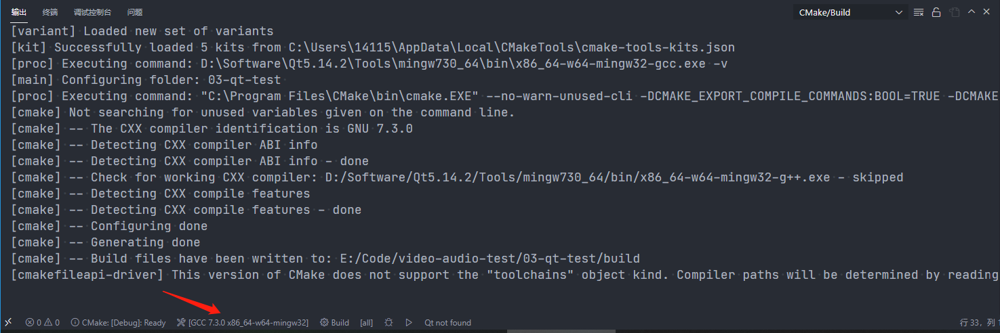
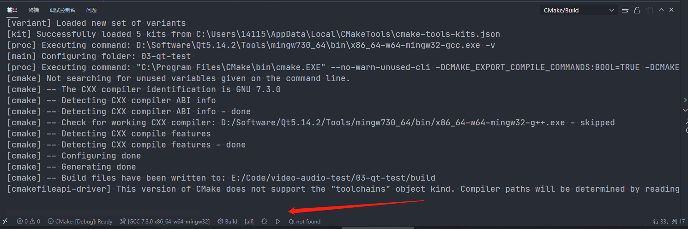
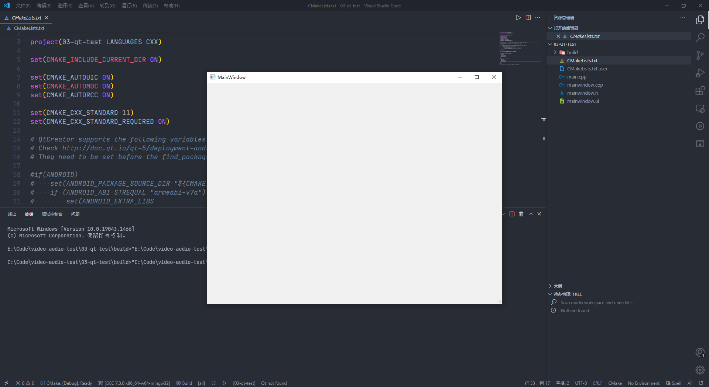

# 背景

因为个人感觉QT Creator使用起来没有VSCode顺手, 故网上查找了一下，在VSCode中搭建QT开发环境的方法。因为QT5过后支持使用CMake构建项目，所以在VSCode中也可以使用CMake构建QT项目。

以下并非原创，只是记录过程，方便自己日后翻阅。文章来自于[CSDN博客](https://blog.csdn.net/weixin_43669941/article/details/108921714)

## 测试环境

* QT 5.14.2(MinGW 7.3.0 64bit)
* CMake 3.19.1
* Visual Studio Code 1.63.2

## 软件&插件安装

### 软件安装

1. QT Creator安装
2. Visual Studio Code安装

### VSCode插件安装

* 在扩展商店搜索插件，点击安装即可

1. C/C++扩展
2. CMake
3. CMake Tools
4. QT tools

## 项目创建

### QT Creator创建项目

### 在VSCode中打开项目

1. 使用 `VSCode`打开 `CMakeLists.txt`文件所在目录
2. 为项目选择 `Kit`
   我选择的是 `MinGW 7.3.0 64bit` ，选择自己项目工具即可

   
3. 运行项目
   点击下图箭头处的倒三角符号`▷`运行即可
   
4. 示意图 倒三角形

   

## Q&A

1. 把QT Creator 加入环境变量(**qt软件**)
    ```bash
    D:\Software\Qt5.14.2\5.14.2\mingw73_64\bin
    ```
2. 把QT Creator tool加入环境变量(**编译器**)
    ```bash
    D:\Software\Qt5.14.2\Tools\mingw730_64\bin
    ```