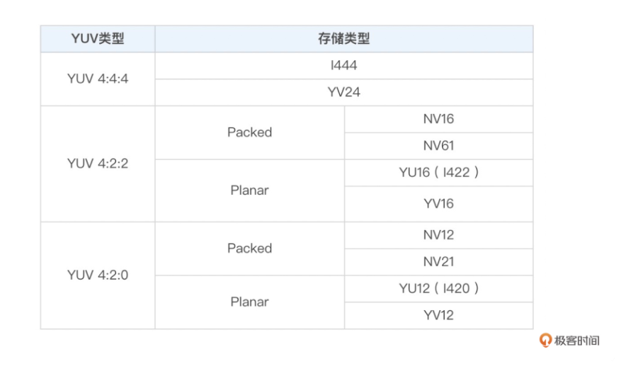
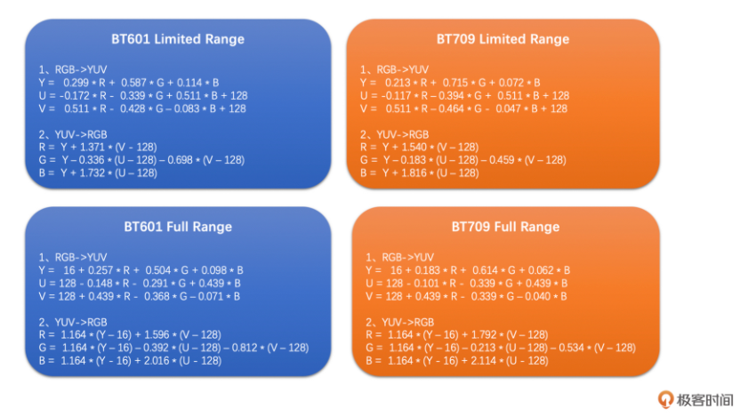
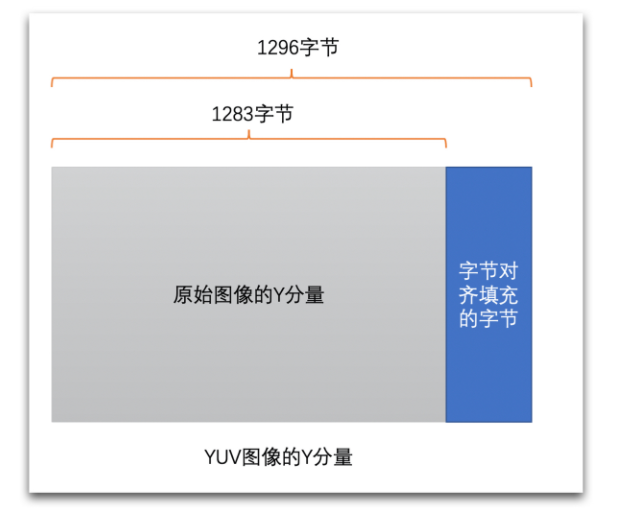

# 基础知识

## 图像基础

### 像素

> 像素是图像的基本单元，一个个像素就组成了图像。也可以认为像素是图像中的一个点。

### 分辨率

> 图像(或视频)的分辨率是指图像的大小或尺寸。我们一般用像素格式来表示图像的尺寸。

比如说一张1920x1080的图像，前者1920指的是该图像的宽度方向上有1920个像素点，而后者1080指的是图像的高度方向上有1080个像素点。

* 常见分辨率：

|名称|分辨率|
|:-:|:-:|
|QCIF|176x144|
|CIF|352x288|
|D1|704(720)x576|
|360P|640x360|
|720P|1280x720|
|1080P|1920x1080|
|4K|4096x2160|
|8K|7680x4320|

### 位深

> 位深是一个像素点中某一个通道（比如R通道、G通道、B通道）的像素值的二进制位的数量

位深越大，表示的颜色值越多，色彩越丰富真实，需要的存储空间也就越大。

### 跨距

> 图像存储时内存中每行像素所占用的空间  

为了能够快速读取一行像素，一般会对内存中的图像实现内存对齐，比如16字节对齐。
例如有一张RGB图像，分辨率时1278*720。将他存储在内存中，一行像素需要1278\*3=3834个字节，3834除以16无法整除。因此，没有16字节对齐。如果需要对齐的话，需要在3834个字节后面再填充6个字节，也就是3840个字节做16字节对齐，这样这幅图像的`跨距(Stride)`就是3840了。

## 视频基础

### 帧率

> 视频是由一系列图像组成的，即“连续”的一帧帧图像组成了视频。  

> 帧率表示一秒钟内图像的数量，单位是fps

事实上，“连续”不是真正意义上的连续，在一秒钟之内，图像的数量是有限的，只是当数量达到一定值后，人眼分辨不出来了，就认为是“连续”的了。

### 码率

> 码率是指视频在单位时间内的数据量(压缩后)的大小，一般是1秒钟内的数量，其单位一般是Kb/s或者Mb/s.

通常，我们用压缩工具压缩同一个原始视频时，`码率越高，图像的失真就越小，视频画面就会越清晰(不是绝对，还要看压缩算法和压缩速度)`。但同时，码率越高，存储时占用的内存空间就会越大，传输时使用的流量就会越多。

## 图像颜色

在现实世界中，我们的眼睛每天看到的颜色是千变万化的。为了能够更方便地表示和处理这些颜色，不同应用领域就建立了多种不同的颜色空间，主要包括 RGB 、YUV、CMYK 、 HSI 等。

### RGB颜色空间

>RGB顾名思义，就是指图像的每一个像素都有R、G、B三个值，且三个值依次排列存储。

一张8bit位深的RGB图，每个值占用一个字节。
但是，需要注意的是RGB图像像素中R、G、B三个值并不一定是按R、G、B顺序排列的，也有可能是B、G、R的顺序排列。OpenCV就经常使用BGR排列方式来存储图像。存储和读取时要注意。

### YUV颜色空间

YUV和RGB类似，也是一种颜色空间，最早主要用于电视系统与模拟视频领域。现在视频领域基本都是使用YUV颜色空间。

> YUV图像将亮度信息Y与色彩信息U、V分离开来。Y表示亮度，是图像的总体轮廓，称之为Y分量。U、V表示色度，主要描绘图像的色彩等信息，分别称为U分量和V分量。

只使用Y分量的图像就是灰度图像(黑白图像),兼容以前的黑白电视机。

>YUV主要分为**YUV444、YUV422、YUV420**这三种常见类型，其中最常见的又是YUV420.

主要区别就是U、V分量像素点的个数和采集方式。YUV444 就是每一个 Y 就对应一个 U 和一个 V；而 YUV422 则是每两个 Y 共用一个 U、一个 V；YUV420 则是每四个 Y 共用一个 U、V。

> YUV存储方式主要分为两大类：Planar、Packed

* **Planar** 格式的 YUV 是先连续存储所有像素点的 Y，然后接着存储所有像素点的 U，之后再存储所有像素点的 V(U分量和V分量的顺序也可以相反，先存储V分量，然后再是U分量)。
* **Packed** 格式的 YUV 是先存储完所有像素的 Y，然后 U、V 连续的交错存储。

### RGB与YUV之间的转换

一般来说，采集到的原始图像和给显示器渲染的最终图像都是RGB图像，但是视频编码一般用的是YUV图像。所有需要互相转换。

对于一个8bit的RGB图像，他的每一个R、G、B分量的取值按理说就是0~255. 但在不同的`Color Range`下是不一样的。

1. **Full Range**的R、G、B取值范围是0~255
2. **Limited Range**的R、G、B取值范围是16~255

RGB和YUV之间转换公式如下：
>目前的标准主要是`BT601`和`BT709`(其实还有`BT2020`), BT601是标清的标准，而BT709是高清的标准。

### 跨距(Stride)问题

在处理 YUV 图像的存储和读取的时候，也是有 Stride 这个概念的。事实上，YUV 出问题的情况更多。在这里举一个例子，比如说一张 1283x720 的图像，一个 Y 分量存储按 16 字节对齐的话应该是每行占用 1296 个字节，所以每读取一行像素的 Y 应该是 1296 个字节，具体如下图所示。千万不要认为是 1283 个字节，不然就会出现“花屏”。这里一定要注意。
