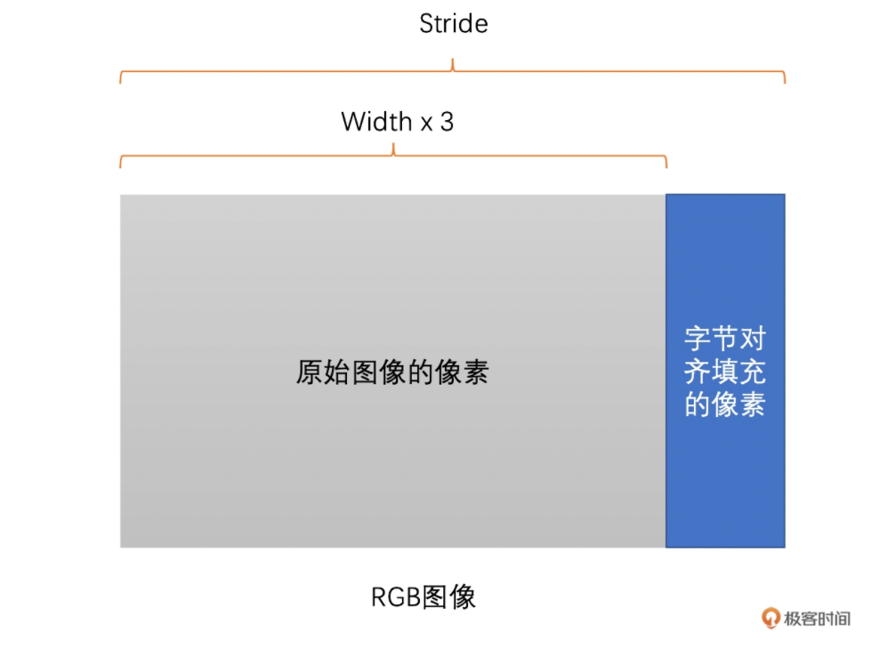
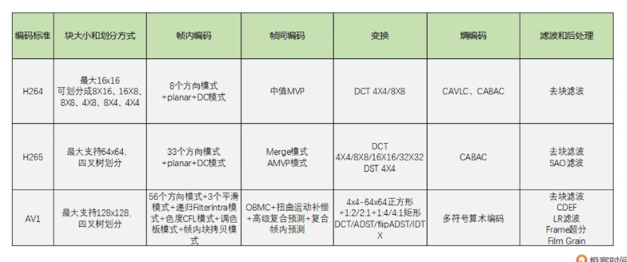

# 基础知识

## 图像基础

### 像素

> 像素是图像的基本单元，一个个像素就组成了图像。也可以认为像素是图像中的一个点。

### 分辨率

> 图像(或视频)的分辨率是指图像的大小或尺寸。我们一般用像素格式来表示图像的尺寸。

比如说一张1920x1080的图像，前者1920指的是该图像的宽度方向上有1920个像素点，而后者1080指的是图像的高度方向上有1080个像素点。

* 常见分辨率：

|名称|分辨率|
|:-:|:-:|
|QCIF|176x144|
|CIF|352x288|
|D1|704(720)x576|
|360P|640x360|
|720P|1280x720|
|1080P|1920x1080|
|4K|4096x2160|
|8K|7680x4320|

### 位深

> 位深是一个像素点中某一个通道（比如R通道、G通道、B通道）的像素值的二进制位的数量

位深越大，表示的颜色值越多，色彩越丰富真实，需要的存储空间也就越大。

### 跨距

> 图像存储时内存中每行像素所占用的空间  

为了能够快速读取一行像素，一般会对内存中的图像实现内存对齐，比如16字节对齐。
例如有一张RGB图像，分辨率时1278*720。将他存储在内存中，一行像素需要1278\*3=3834个字节，3834除以16无法整除。因此，没有16字节对齐。如果需要对齐的话，需要在3834个字节后面再填充6个字节，也就是3840个字节做16字节对齐，这样这幅图像的`跨距(Stride)`就是3840了。

### 帧率

> 视频是由一系列图像组成的，即“连续”的一帧帧图像组成了视频。  

> 帧率表示一秒钟内图像的数量，单位是fps

事实上，“连续”不是真正意义上的连续，在一秒钟之内，图像的数量是有限的，只是当数量达到一定值后，人眼分辨不出来了，就认为是“连续”的了。

### 码率

> 码率是指视频在单位时间内的数据量(压缩后)的大小，一般是1秒钟内的数量，其单位一般是Kb/s或者Mb/s.

通常，我们用压缩工具压缩同一个原始视频时，`码率越高，图像的失真就越小，视频画面就会越清晰(不是绝对，还要看压缩算法和压缩速度)`。但同时，码率越高，存储时占用的内存空间就会越大，传输时使用的流量就会越多。

## 图像颜色

在现实世界中，我们的眼睛每天看到的颜色是千变万化的。为了能够更方便地表示和处理这些颜色，不同应用领域就建立了多种不同的颜色空间，主要包括 RGB 、YUV、CMYK 、 HSI 等。

### RGB颜色空间

>RGB顾名思义，就是指图像的每一个像素都有R、G、B三个值，且三个值依次排列存储。

一张8bit位深的RGB图，每个值占用一个字节。
但是，需要注意的是RGB图像像素中R、G、B三个值并不一定是按R、G、B顺序排列的，也有可能是B、G、R的顺序排列。OpenCV就经常使用BGR排列方式来存储图像。存储和读取时要注意。

### YUV颜色空间

YUV和RGB类似，也是一种颜色空间，最早主要用于电视系统与模拟视频领域。现在视频领域基本都是使用YUV颜色空间。

> YUV图像将亮度信息Y与色彩信息U、V分离开来。Y表示亮度，是图像的总体轮廓，称之为Y分量。U、V表示色度，主要描绘图像的色彩等信息，分别称为U分量和V分量。

只使用Y分量的图像就是灰度图像(黑白图像),兼容以前的黑白电视机。

>YUV主要分为**YUV444、YUV422、YUV420**这三种常见类型，其中最常见的又是YUV420.

主要区别就是U、V分量像素点的个数和采集方式。YUV444 就是每一个 Y 就对应一个 U 和一个 V；而 YUV422 则是每两个 Y 共用一个 U、一个 V；YUV420 则是每四个 Y 共用一个 U、V。

> YUV存储方式主要分为两大类：Planar、Packed

* **Planar** 格式的 YUV 是先连续存储所有像素点的 Y，然后接着存储所有像素点的 U，之后再存储所有像素点的 V(U分量和V分量的顺序也可以相反，先存储V分量，然后再是U分量)。
* **Packed** 格式的 YUV 是先存储完所有像素的 Y，然后 U、V 连续的交错存储。

### RGB与YUV之间的转换

一般来说，采集到的原始图像和给显示器渲染的最终图像都是RGB图像，但是视频编码一般用的是YUV图像。所有需要互相转换。

对于一个8bit的RGB图像，他的每一个R、G、B分量的取值按理说就是0~255. 但在不同的`Color Range`下是不一样的。

1. **Full Range**的R、G、B取值范围是0~255
2. **Limited Range**的R、G、B取值范围是16~255

RGB和YUV之间转换公式如下：
>目前的标准主要是`BT601`和`BT709`(其实还有`BT2020`), BT601是标清的标准，而BT709是高清的标准。

### 跨距(Stride)问题

在处理 YUV 图像的存储和读取的时候，也是有 Stride 这个概念的。事实上，YUV 出问题的情况更多。在这里举一个例子，比如说一张 1283x720 的图像，一个 Y 分量存储按 16 字节对齐的话应该是每行占用 1296 个字节，所以每读取一行像素的 Y 应该是 1296 个字节，具体如下图所示。千万不要认为是 1283 个字节，不然就会出现“花屏”。这里一定要注意。

## 视频编码

### 原理

视频编码是对一帧帧图像来进行的。一般我们所熟知的彩色图像的格式是 RGB 的，即用红绿蓝三个分量的组合来表示所有颜色。但是，RGB 三个颜色是有相关性的，为了去掉这个相关性，减少需要编码的信息量，我们通常会把 RGB 转换成 YUV，也就是 1 个亮度分量和 2 个色度分量。另外，人眼对于亮度信息更加敏感，而对于色度信息稍弱，所以视频编码是将 Y 分量和 UV 分量分开来编码的。

而对于每一帧图像，又是划分成一个个块来进行编码的，这一个个块在 H264 中叫做宏块，而在 VP9、AV1 中称之为超级块，其实概念是一样的。宏块大小一般是 16x16（H264、VP8），32x32（H265、VP9），64x64（H265、VP9、AV1），128x128（AV1）这几种。这里提到的 H264、H265、VP8、VP9 和 AV1 都是市面上常见的编码标准，下面我会介绍，这里就不再详细讲述。

**图像一般都是有数据冗余的**，主要包括以下 **4** 种：

* **空间冗余**。比如说将一帧图像划分成一个个 16x16 的块之后，相邻的块很多时候都有比较明显的相似性，这种就叫空间冗余。
* **时间冗余**。一个帧率为 25fps 的视频中前后两帧图像相差只有 40ms，两张图像的变化是比较小的，相似性很高，这种叫做时间冗余。
* **视觉冗余**。我们的眼睛是有视觉灵敏度这个东西的。人的眼睛对于图像中高频信息的敏感度是小于低频信息的。有的时候去除图像中的一些高频信息，人眼看起来跟不去除高频信息差别不大，这种叫做视觉冗余。
* **信息熵冗余**。我们一般会使用 Zip 等压缩工具去压缩文件，将文件大小减小，这个对于图像来说也是可以做的，这种冗余叫做信息熵冗余。视频编码就是通过减少上述 4 种冗余来达到压缩视频的目的。

编码对比：

### 步骤

视频编码主要分为熵编码、预测、DCT 变换和量化这几个步骤。

1. **熵编码（以行程编码为例）**：视频编码中真正实现“压缩”的步骤，主要去除信息熵冗余。在出现连续多个 0 像素的时候压缩率会更高。
2. **帧内预测**：为了提高熵编码的压缩率，先将当前编码块的相邻块像素经过帧内预测算法得到帧内预测块，再用当前编码块减去帧内预测块得到残差块，从而去掉空间冗余。
3. **帧间预测**：类似于帧内预测，在已经编码完成的帧中，先通过运动搜索得到帧间预测块，再与编码块相减得到残差块，从而去除时间冗余。
4. **DCT 变换和量化**：将残差块变换到频域，分离高频和低频信息。由于高频信息数量多但大小相对较小，又人眼对高频信息相对不敏感，我们利用这个特点，使用 QStep 对 DCT 系数进行量化，将大部分高频信息量化为 0，达到去除视觉冗余的目的。

### 码流结构

视频编码的码流结构其实就是指视频经过编码之后得到的二进制数据是怎么组织的，换句话说，就是编码后的码流我们怎么将一帧帧编码后的图像数据分离出来，以及在二进制码流数据中，哪一块数据是一帧图像，哪一块数据是另外一帧图像。

#### H264的编码结构

##### 帧类型

我们知道帧内预测不需要参考已编码帧，对已编码帧是没有依赖的，并可以自行完成编码和解码。而帧间预测是需要参考已编码帧的，并对已编码帧具有依赖性。帧间预测需要参考已经编码好了的帧内编码帧或者帧间编码帧。并且，帧间编码帧又可以分为只参考前面帧的前向编码帧，和既可以参考前面帧又可以参考后面帧的双向编码帧。

为了做区分，在 H264 中，我们就将图像分为以下不同类型的帧。

三种帧的示例图如下所示。例如，从左向右，第一个 B 帧参考第一个 I 帧和第一个 P 帧，第一个 P 帧只参考第一个 I 帧（箭头是从参考帧指向编码帧）。

由于 P 帧和 B 帧需要参考其它帧。如果编码或者解码的过程中有一个参考帧出现错误的话，那依赖它的 P 帧和 B 帧肯定也会出现错误，而这些有问题的 P 帧（B 帧虽然也可以用来作为参考帧，但是一般用的比较少，所以这里不讨论）又会继续作为之后 P 帧或 B 帧的参考帧。因此，**错误会不断的传递**。为了避免错误的不断传递，就有了一种**特殊的 I 帧叫 IDR 帧，也叫立即刷新帧**。

##### GOP

在 H264 中，还有一个 GOP 的概念也经常会遇到，它是什么意思呢？从一个 IDR 帧开始到下一个 IDR 帧的前一帧为止，这里面包含的 IDR 帧、普通 I 帧、P 帧和 B 帧，我们称为一个 **GOP（图像组）**（这是 closed GOP，还有一种 opened GOP，比较少见，这里不讨论）。

在一个视频图像序列中，我们将其划分成一个个 GOP。**GOP 包含一个 IDR 帧到下一个 IDR 帧的前一帧中的所有帧**。GOP 的大小选择需要根据**实际应用场景**来选择，**一般 RTC 和直播场景可以稍微大一些，而点播场景一般小一些**。

##### Slice

在 H264 中，每一帧图像又可以分为 I 帧、P 帧和 B 帧，而 I 帧又包含了普通 I 帧和 IDR 帧。帧可以划分为一个或者多个 Slice，并且**最后帧都是以 Slice 的方式在码流中呈现**。同时 H264 码流中除了 Slice 数据之外，还有 **SPS 和 PPS 两个参数集，分别用来存放基础图像信息和基础编码参数**。SPS 和 PPS 非常重要，如果丢失了，将无法进行解码。

##### NALU

每一个 Slice 和 SPS、PPS 都是通过 NALU 来封装的，且 NALU 含有一个 1 字节的 NALU Header。我们可以通过 NALU Header 中的 NALU Type 来判断 NALU 的类型。同时，每一个 NALU 的分隔有两种方式：一种是 Annexb 格式，通过使用起始码分隔；一种是 MP4 格式，通过一个 4 字节的长度来表示 NALU 的大小，从而起到分隔的作用。