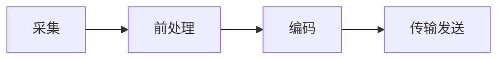

# 音频

声音的本质是空气压力差造成的空气振动，振动产生的声波可以在介质中快速传播，当声波到达接收端时（比如：人耳、话筒），引起相应的振动，最终被听到。

两个基本属性：

* 振幅。声音的振幅就是音量。
* 频率。频率的高低就是音调，频率的单位是赫兹（Hz）。

当声波传递到话筒时，话筒里的碳膜会随着声音一起振动，而碳膜下面是一个电极，碳膜振动时会触碰电极，接触时间的长短跟振动幅度有关（即：声音响度），这样就完成了声音信号到电压信号的转换。后面经过电路放大后，就得到了模拟音频信号。

>模拟音频：用连续的电流或电压表示的音频信号，在时间和振幅上是连续。过去记录的声音都是模拟音频，比如：机械录音（以留声机、机械唱片为代表）、磁性录音（以磁带录音为代表）等模拟录音方式。

计算机不能直接处理连续的模拟信号，所以需要进行A/D转换，以一定的频率对模拟信号进行采样（就是获取一定时间间隔的波形振幅值，采样后模拟出的波形与原始波形之间的误差称为采样噪音），然后再进行量化和存储，就得到了数字音频。

>数字音频：通过采样和量化获得的离散的、数字化的音频信号，即：计算机可以处理的二进制的音频数据。

相反的，当通过扬声器播放声音时，计算机内部的数字信号通过D/A转换，还原成了强弱不同的电压信号。这种强弱变化的电压会推动扬声器的振动单元产生震动，就产生了声音。

## PCM元数据

最常见的A/D转换是通过脉冲编码调制 PCM (Pulse Code Modulation)。要将连续的电压信号转换为PCM，需要进行采样和量化，我们一般从如下几个维度描述PCM：

### 采样频率（Sampling Rate）

单位时间内采集的样本数，采样周期的倒数，指两个采样之间的时间间隔。采样频率越高，声音质量越好，但同时占用的带宽越大。

    * 8,000 Hz - 电话所用采样率, 对于人的说话已经足够
    * 11,025 Hz - AM调幅广播所用采样率
    * 22,050 Hz和24,000 Hz - FM调频广播所用采样率
    * 32,000 Hz - miniDV 数码视频 camcorder、DAT (LP mode)所用采  样率
    * 44,100 Hz - 音频 CD, 也常用于 MPEG-1 音频（VCD, * SVCD,MP3）所用采样率
    * 47,250 Hz - 商用 PCM 录音机所用采样率
    * 48,000 Hz - miniDV、数字电视、DVD、DAT、电影和专业音频所用的数字声音所用采样率
    * 50,000 Hz - 商用数字录音机所用采样率
    * 96,000 或者 192,000 Hz - DVD-Audio、一些 LPCM DVD 音轨、BD-ROM（蓝光盘）音轨、和 HD-DVD （高清晰度 DVD）音轨所用所用采样率
    * 2.8224 MHz - Direct Stream Digital的1位sigma-delta modulation 过程所用采样率。

### 采样位数

    表示一个样本的二进制位数,每个采样点用多少比特表示。
    1. 量化.音频量化的量化位数常用的有：
        - 8bit (也就是1字节) 只能记录 256 个数, 也就是只能将振幅划分成 256 个等级
        - 16bit  (也就是2字节) 可以细到 65536 个数, 这已是 CD 标准
        - 32bit (也就是4字节) 能把振幅细分到 4294967296 个等级
    2. 二进制编码。也就是把量化所得的结果，即单个声道的样本，以二进制的码字进行存放。其中有两种存放方式：
        - 直接以整形来存放量化结果,比如：8 bit的样本数据，有符号的范围是-128 ~ 127，无符号的范围是0 ~ 255。
        - 以浮点类型来存放量化结果
        >大多数格式的PCM样本数据使用整形来存放，而在对一些对精度要求高的应用方面，则使用浮点型来表示PCM 样本数据。

### 声道

当人听到声音时，能对声源进行定位，那么通过在不同的位置设置声源，就可以造就出更好的听觉感受，如果配合影像进行音频位置的调整，则会得到更好的视听效果。

    * 单声道，记录声音时，每次生成一个声波数据，称为单声道
    * 双声道 ，记录声音时，每次生成两个声波数据，称为双声道，最常见的类型，包括左声道和右声道
    * 2.1声道，在双声道基础上加入一个低音声道
    * 5.1声道，包含一个正面声道、左前方声道、右前方声道、左环绕声道、右环绕声道、一个低音声道，最早应用于早期的电影院
    * 7.1声道，在5.1声道的基础上，把左右的环绕声道拆分为左右环绕声道以及左右后置声道，主要应用于BD以及现代的电影院

### 音频大小

   >数字音频文件大小（Byte) = 采样频率（Hz）× 采样时长（S）×（采样位数 / 8）× 声道数（单声道为1，立体声为2）

### 帧

音频在量化得到二进制的码字后，需要进行变换，而变换（MDCT）是以块为单位（block）进行的，一个块由多个（120或128）样本组成。而一帧内会包含一个或者多个块。帧的常见大小有960、1024、2048、4096等。一帧记录了一个声音单元，它的长度是样本长度和声道数的乘积。FFmpeg中 AVFrame 结构体中的 nb_samples 代表的就是一帧中单个声道的音频样本数量。

### 样本格式

样本格式主要有：

```C++
enum AVSampleFormat {
    AV_SAMPLE_FMT_NONE = -1,
    AV_SAMPLE_FMT_U8,          ///< unsigned 8 bits
    AV_SAMPLE_FMT_S16,         ///< signed 16 bits
    AV_SAMPLE_FMT_S32,         ///< signed 32 bits
    AV_SAMPLE_FMT_FLT,         ///< float
    AV_SAMPLE_FMT_DBL,         ///< double
 
    AV_SAMPLE_FMT_U8P,         ///< unsigned 8 bits, planar
    AV_SAMPLE_FMT_S16P,        ///< signed 16 bits, planar
    AV_SAMPLE_FMT_S32P,        ///< signed 32 bits, planar
    AV_SAMPLE_FMT_FLTP,        ///< float, planar
    AV_SAMPLE_FMT_DBLP,        ///< double, planar
    AV_SAMPLE_FMT_S64,         ///< signed 64 bits
    AV_SAMPLE_FMT_S64P,        ///< signed 64 bits, planar
 
    AV_SAMPLE_FMT_NB           ///< Number of sample formats. DO NOT USE if linking dynamically
};
```

> 其中有U8（无符号整型8bit）、S16（整型16bit）、S32（整型32bit）、FLT（单精度浮点类型）、DBL（双精度浮点类型）、S64（整型64bit），不以P为结尾的都是interleaved结构，以P为结尾的是planar结构

### 样本组合方式

主要是针对双声道或多声道音频来说的，对于一个双声道音频来说，它的组合方式可能有以下两种：

1. 交错（interleaved）。以stereo为例，一个stereo音频的样本是由两个单声道的样本交错地进行存储得到的。
    >LRLRLRLR
2. 平面（planar）。各个声道的样本分开进行存储。
    >LLLLRRRR

## 音频应用流程




## 音频编解码

### 编解码

* 音频编码的主要作用是将音频采样数据(PCM等)，压缩成为音频码流，从而降低音频的数据量，便于存储和传输。  
* 音频解码就是编码的逆过程。

压缩分为有损压缩和无损压缩

* 有损压缩就是通过舍弃已有数据中不太重要的数据来达到压缩目的
* 无损压缩就是通过优化排列方式来达到压缩目的

#### 常见音频编解码格式 [维基百科]

|格式|作者|首次公开发布|开源实现|无损压缩|专利格式|
|:--:|:--:|:--:|:--:|:--:|:--:|
|AAC|ISO/IEC MPEG Audio Commitee|1997|FFmpeg Audiocogs(仅解码)|MPEG-4 SLS|付费|
|ALAC|Apple Inc|2004-04-28|MacOSforge, FFmpeg,Audiocogs(仅解码)|是|免费|
|FLAC|Xiph.Org Foundation, Josh Coalson|2001-07-20|FLAC, Flake(仅编码), FFmpeg, FLACCL(仅编码), Audiocogs(仅解码)|是|NO|
|G.711|ITU-T|1972|FFmpeg,Ekiga,Asterisk|否|NO|
|G.722|ITU-T|1988-11|Asterisk(PBX), QuteCom,FFmpeg|否|NO|
|G.722.1|ITU-T|1999-09||否|付费 是|
|G.722.2|ITU-T|2002-10|FFmpeg(仅解码),Android(仅解码)|否|付费 是|
|G.723.1|ITU-T|1996-03|FFmpeg|否|付费 是|
|G.726|ITU-T|1990-12|FFmpeg, Ekiga|否|NO|
|G.728|ITU-T|1992-09||否|付费 是|
|G.729|ITU-T|19906-03|FFmpeg(仅解码)|否|付费 是|
|MP3|ISO/IEC MPEG Audio Commitee|1993|LAME(仅编码),FFmpeg(仅解码)|否|付费 是|
|opus|IETF|2012-09-11|libopus,FFmpeg|否|免费|
|WavPack|Conifer Software|1998|WavPack, FFmpeg(仅解码)|是|NO|

## 音频处理算法概念

[概念大全](https://shichaog1.gitbooks.io/hand-book-of-speech-enhancement-and-recognition/content/chapter1.html)

### AEC（Auto  echo cancellation）：自适应回声消除

AEC算法早期用在Voip，电话这些场景中，自从智能设备诞生后，智能语音设备也要消除自身的音源，这些音源包括音乐或者TTS机器合成声音。回声消除的基本原理是使用一个自适应滤波器对未知的回声信道:ω \omegaω 进行参数辨识，根据扬声器信号与产生的多路回声的相关性为基础，建立远端信号模型，模拟回声路径，通过自适应算法调整，使其冲击响应和真实回声路径相逼近。然后将麦克风接收到的信号减去估计值，即可实现回声消除功能。

### ANS（Automatic Noise suppression）：自动噪声抑制

背景噪声抑制（ANS）指的是将声音中的背景噪声识别并进行消除的处理。

背景噪声分为平衡噪声和瞬时噪声两类，平稳噪声的频谱稳定，瞬时噪声的频谱能量方差小，利用噪声的特点，对音频数据添加反向波形处理，即可消除噪声。

### AGC（Automatic Gain Control）：自动增益控制

当有对语音的响度进行调整的需要时，就要做语音自动增益（AGC）算法处理，当你在跟远方的朋友进行语音交流时，背后都有这个算法在默默的工作。最简单的硬性增益处理是对所有音频采样乘上一个增益因子，它也等同于在频域每个频率都同时乘上这个增益因子，但由于人的听觉对所有频率的感知不是线性的，是遵循等响度曲线的，导致这样处理后，听起来感觉有的频率加强了，有的频率削弱了，导致语言失真的放大。

要让整个频段的频率听起来响度增益都是“相同”的，就必须在响度这个尺度下做增益，而不是在频率域，即按照等响度曲线对语音的频率进行加权，不能采用一个固定的增益因子进行加权。

由些可见，语音的自动增益处理可以大致分为两个部分：（1）响度增益因子的确定。（2）把响度增益因子映射到等响度曲线上，确定最终各频率的增益权重。

最后要做的就是把各频率乘上最终的增益权重，我们就可以得到最终增益后的语音了！这里再说下如何获取等响度曲线的值，总体思路是可以利用数值分析中的逼近理论做插值和拟合

### VAD(voice activity detection) ：语音检测

VAD(voice activity detection)广泛应用于语音编码，降噪和ASR场景中。它的作用是从一段语音（纯净或带噪）信号中标识出语音片段与非语音片段。这里所说的是语音/非语音（非语音/静音）检测，一个VAD系统通常包括两个部分，特征提取和语音/非语音判决，常用的特征提取可以分为五类：
* 基于能量
* 频域
* 倒谱
* 谐波
* 长时信息 基于能量的特征常用硬件实现，谱（频谱和倒谱）在低SNR可以获得较好的效果。当SNR到达0dB时，基于语音谐波和长时语音特征更具有鲁棒性。当前的判决准则可以分为三类：基于门限，统计模型和机器学习。

### DRC(Dynamic range compression) ：动态压缩

在声学领域中，DRC(Dynamic range compression) 一般用来动态调整音频输出幅值，在音量大时压制音量在某一范围内，在音量小时适当提升音量。通常用于控制音频输出功率，使扬声器不破音，当处于低音量播放时也能清晰听到。

DRC通常用于声音的记录和再现，广播，现场声音增强和某些乐器放大器中。

### BF（Beamforming）：波束形成

波束成形是天线技术与数字信号处理技术的结合，目的用于定向信号传输或接收。 波束成形，并非新名词，其实它是一项经典的传统天线技术。早在上世纪60年代就有采用天线分集接收的阵列信号处理技术，在电子对抗、相控阵雷达、声纳等通信设备中得到了高度重视。基于数字波束形成（DBF）的自适应阵列干扰置零技术，能够提高雷达系统的抗干扰能力，是新一代军用雷达必用的关键技术。定位通信系统通过传声器阵列获取声场信息，使用波束成形和功率谱估计原理，对信号进行处理，确定信号来波方向，从而可对信源进行精确定向。只不过，由于早年半导体技术还处在微米级，所以它没有在民用通信中发挥到理想的状态。

### BSS（Blind source separation）：盲源分离

盲源分离（BSS: Blind Source Separation），又称为盲信号分离，是指在信号的理论模型和源信号无法精确获知的情况下，如何从混迭信号（观测信号）中分离出各源信号的过程。盲源分离和盲辨识是盲信号处理的两大类型。盲源分离的目的是求得源信号的最佳估计，盲辨识的目的是求得传输通道的混合矩阵。盲源信号分离是一种功能强大的信号处理方法，在生物医学信号处理，阵列信号处理，语音信号识别，图像处理及移动通信等领域得到了广泛的应用。

### DOA（Direction of arrival）：声源定位

现在常见的麦克风声源定位算法多见于TDOA算法，其基本原理是根据信号到达两个不同位置的麦克风的时间差，估计出信号到达两个不同位置麦克风的距离差，可以列出一个双曲线方程，同时使用另外两个不同的麦克风同时检测信号可以得到另外一个双曲线方程，两个双曲线方程的交点就是声源的位置坐标。使用这种方法进行声源定位时，至少要使用三个麦克风，使用两次TDOA算法进行运算，才能完成一次定位操作。为了实现更精确的声源定位，也常采用阵列技术，将多个麦克风组成线阵，或方阵采集信号进行声源定位。但这种定位技术的算法更为复杂。

### DER(Dereverberation)：去混响

通常在声音信号采集或录制的情况下, 传声器除了接收到所需要的声源发射声波直接到达的部分外,还会接收声源发出的、经过其它途径传递而到达的声波, 以及所在环境其它声源产生的不需要的声波(即背景噪声)。在声学上, 延迟时间达到约 50 ms 以上的反射波称为回声, 其余的反射波产生的效应称为混响。混响现象将对期望声信号的接收效果产生影响。一些建筑, 如音乐厅和教堂, 需要适度的混响作用而使音乐更加动听。但在许多场合, 混响往往会带来干扰, 导致声学接收系统性能变差。例如, 混响会导致语音识别系统性能显著下降; 在远程会议、免提电话、助听器和移动通信中, 混响作用主要带来负面影响。当混响严重时,这些系统甚至无法正常发挥功能, 因此, 如何减少混响对声音接收系统的影响, 即去混响(dereverberation),是一个非常重要的课题。

[维基百科]: https://zh.wikipedia.org/wiki/%E9%9F%B3%E9%A2%91%E7%BC%96%E7%A0%81%E6%A0%BC%E5%BC%8F%E7%9A%84%E6%AF%94%E8%BE%83
